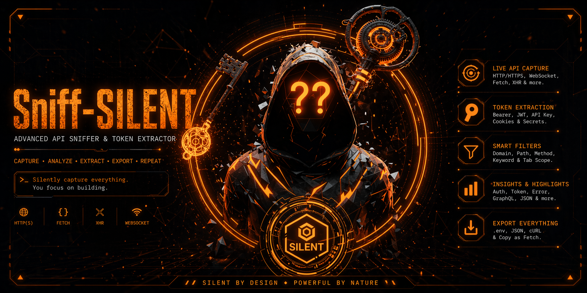

<p align="center">
  
</p>

# Sniff-SILENT

Sniff-SILENT is a Chrome extension for monitoring API traffic directly from the browser with a persistent side-panel workflow, session-based capture, smart filtering, token extraction, and incognito-focused usage for cleaner results.

## What It Does

- Captures browser traffic from `fetch` and `XMLHttpRequest`
- Extracts useful auth artifacts such as Bearer tokens, JWTs, API keys, and cookies
- Opens in a persistent side panel instead of a popup that closes on click
- Supports quick start for the active tab
- Adds session-based capture so logs stay organized
- Filters by domain, path, method, and keyword
- Highlights important traffic such as `AUTH`, `TOKEN`, `ERROR`, `GRAPHQL`, and `JSON`
- Collapses duplicate requests and shows repeat counters
- Exports captured data as `.env`, JSON, and cURL
- Runs in incognito-only mode for a more isolated capture environment

## Why Incognito

This extension is intentionally optimized for incognito usage.

Benefits:

- fewer unrelated cookies and sessions
- less noise from normal browsing activity
- cleaner login and onboarding flows
- easier isolation per target site

The extension is configured to work only from incognito windows after `Allow in Incognito` is enabled in Chrome.

## Main Features

### 1. Side Panel Monitoring

The extension opens as a side panel so it stays visible while you interact with the target site.

### 2. Quick Start Flow

Use `Quick Start This Tab` to:

- bind capture to the active tab
- auto-fill the current site into the filter
- generate a session name automatically
- start capture immediately

### 3. Session Capture

Each capture run can be grouped into a named session, making it easier to separate different login attempts, flows, or targets.

### 4. Smart Highlighting

Requests are tagged automatically when they look important:

- `AUTH`
- `TOKEN`
- `ERROR`
- `GRAPHQL`
- `JSON`

### 5. Export Tools

Captured logs can be exported as:

- `.env`
- `.json`
- `cURL`

## Installation

1. Open `chrome://extensions`
2. Enable `Developer mode`
3. Click `Load unpacked`
4. Select this project folder
5. Open the extension details page
6. Enable `Allow in Incognito`

## Recommended Usage

1. Open a new incognito window with `Ctrl + Shift + N`
2. Open the target website inside that incognito window
3. Click the extension icon to open the side panel
4. Press `Quick Start This Tab`
5. Perform the actions you want to observe
6. Watch captured requests, tokens, and highlights in real time
7. Export the result if needed

## Capture Controls

The side panel includes:

- session name input
- start new session
- stop session
- domain filter
- path filter
- method filter
- keyword filter
- active-tab-only toggle

## Project Structure

```text
.
|- assets/
|  `- readme-banner.png
|- icons/
|  |- icon16.png
|  |- icon32.png
|  |- icon48.png
|  |- icon128.png
|  `- icon-master.png
|- background.js
|- content.js
|- inject.js
|- manifest.json
|- popup.html
|- popup.js
`- README.md
```

## Core Files

- `manifest.json`
  Defines permissions, side panel entry, content scripts, icons, and incognito behavior.
- `inject.js`
  Hooks into page-level `fetch` and `XMLHttpRequest`.
- `content.js`
  Bridges page events into the extension runtime.
- `background.js`
  Applies capture rules, stores requests and tokens, handles dedupe, and manages incognito-only behavior.
- `popup.html` and `popup.js`
  Render and control the side-panel interface.

## Current Behavior Summary

- capture is off by default
- only incognito traffic is accepted
- side panel is preferred over popup mode
- active-tab capture is supported
- duplicate requests are merged
- tokens and requests are stored locally in extension storage

## Notes

- This project is intended for controlled browser-side traffic observation
- Chrome still requires `Allow in Incognito` to be enabled manually by the user
- If you use multiple tabs, `active tab only` is the safest default for keeping results focused

## Repository

GitHub: `lhuciverjobs-ui/Sniff-SILENT`
